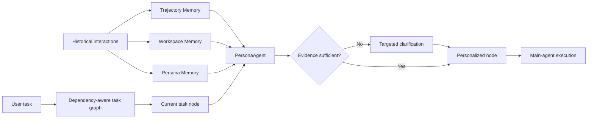

<div align="center">

# AutoPersona

### Structured Personalized Memory for Proactive Long-Horizon Agents

**Research project · April–July 2026**

[](https://github.com/Ailta666508/AutoPersona/actions/workflows/ci.yml)


[Overview](#overview) · [Research Experience](#research-experience) · [Architecture](#architecture) · [Code Scope](#code-scope) · [Quick Start](#quick-start)

</div>

> [!NOTE]
> This repository publishes a curated reference implementation of the memory and task-execution runtime developed during the project. It does not include a manuscript, submission metadata, unpublished result tables, model checkpoints, benchmark data, or the complete training and evaluation stack.

## Overview

Long-horizon personal assistants often receive an explicit task while user preferences, workspace state, and execution constraints remain unstated. A useful memory system must do more than retrieve similar history: it must determine which evidence applies to the current task, identify missing information, and decide when to ask rather than guess.

**AutoPersona** addresses this problem with a three-layer memory bank and a dedicated `PersonaAgent`. The framework separates historical task evidence, workspace state, and reusable personalization strategies; retrieves relevant evidence for the current task node; requests targeted clarification when the evidence is insufficient; and injects the resulting constraints into dependency-aware execution.

## Research Experience

The AutoPersona research project was conducted from **April to July 2026**. My work included:

- proposing a proactive personalized-memory framework for resolving implicit requirements in long-horizon agent tasks;
- designing a structured architecture with **Trajectory Memory**, **Workspace Memory**, and **Persona Memory** for execution traces, environment state, task context, user preferences, and reusable assistance strategies;
- building evaluation settings that study incomplete context, noisy memories, evolving preferences, hidden intents, memory retrieval, constraint adherence, and personalization consistency;
- developing a two-stage learning pipeline that combines supervised fine-tuning with **Group Relative Policy Optimization (GRPO)** to improve memory summarization and proactive clarification behavior;
- integrating node-level personalization into dependency-aware task execution so that constraints are applied where they matter instead of being appended once to the initial prompt.

The full research workflow included training and benchmark evaluation. The public repository intentionally exposes only the framework-independent runtime described below; [Code and research alignment](docs/CODE_SCOPE.md) records the boundary in detail.

## Architecture



### 1. Construct the memory bank

A completed task is refined into three complementary representations:

| Layer | Contents | Runtime role |
| :--- | :--- | :--- |
| Trajectory | User request, key actions, outcome, reusable insight | Traceable historical evidence |
| Workspace | Task state, environment interactions, current state | Task continuity and environment context |
| Persona | Applicable topic, preference or constraint, assistance strategy | Reusable personalization guidance |

New workspace and persona items are compared with existing memories and resolved through add, update, delete, or no-op decisions.

### 2. Retrieve and decide

`MemoryRetriever` selects evidence separately for each memory layer. `PersonaAgent` consumes the retrieved bundle and returns one of two explicit decisions:

- `final`: return personalized guidance for execution;
- `clarify`: pause and ask a concrete question because required information is missing.

### 3. Execute a personalized task graph

`MemoryAwareExecutor` validates and topologically orders task nodes. Before each node runs, it invokes `PersonaAgent`; predecessor outputs and relevant memories are then passed to the task runner. Execution pauses safely if clarification is required.

A paused `ExecutionState` can be resumed with the user's clarification answer. Completed node outputs are validated and reused, so external tool calls are not repeated.

## Code Scope

### Included in this repository

- typed memory models and per-user JSONL persistence;
- trajectory, workspace, and persona refinement;
- embedding-based retrieval separated by memory layer;
- memory add, update, delete, and no-op orchestration;
- a Persona2Web record adapter;
- proactive clarification decisions;
- memory-aware DAG execution and runtime metrics;
- deterministic, API-free tests and a minimal runnable example;
- an API-free clarification-policy evaluator with per-case retrieval diagnostics.

### Part of the research, not included here

- SFT data construction and model training;
- the GRPO reward, optimization loop, and model integration;
- benchmark datasets and redistribution-controlled assets;
- end-to-end evaluation harnesses and judge-model integrations;
- checkpoints, raw predictions, experiment logs, and unpublished tables.

The distinction matters: this repository is suitable for inspecting and testing the runtime abstractions, but it is not an artifact-complete reproduction package.

## Quick Start

The package requires **Python 3.10+** and has no runtime dependencies outside the standard library.

```bash
git clone https://github.com/Ailta666508/AutoPersona.git
cd AutoPersona
python3.10 -m venv .venv
source .venv/bin/activate
python -m pip install -e .
python -m unittest discover -s tests -v
python examples/minimal_demo.py
python examples/evaluate_clarification.py
python examples/resume_after_clarification.py
```

The examples use deterministic local stand-ins for embedding, memory resolution, and policy decisions. They do not call an LLM API or reproduce research experiments.

### Core API

```python
from autopersona_memory import (
    JsonlMemoryStore,
    MemoryRetriever,
    MemoryUpdater,
    PersonaAgent,
    RawTaskRecord,
    ingest_task_history,
)

store = JsonlMemoryStore("./memory")
embed = lambda text: [float("open-source" in text.lower()), 1.0]
resolve = lambda memory_type, new, candidates: {"operation": "add", "memory": new}
updater = MemoryUpdater(store, embed, resolve)

ingest_task_history(
    store,
    updater,
    RawTaskRecord(
        user_id="demo-user",
        query="Find related work",
        outcome="completed",
        persona=[{
            "topic": "paper search",
            "preference": "Prefer open-source work",
            "strategy": "Check code availability and reproduction cost",
        }],
    ),
)
```

## Repository Guide

```text
autopersona_memory/
  models.py             # Typed requests, decisions, and three memory layers
  store.py              # Per-user JSONL persistence
  refinement.py         # Raw history to structured memories
  extraction.py         # Memory update orchestration
  retrieval.py          # Per-layer similarity retrieval
  persona_agent.py      # Retrieval and clarify/final decision boundary
  execution.py          # Memory-aware DAG execution
  metrics.py            # Lightweight runtime metrics
  evaluation.py         # Synthetic clarification-policy evaluation
  adapters/persona2web.py
examples/minimal_demo.py
examples/evaluate_clarification.py
examples/resume_after_clarification.py
tests/
docs/
```

## Engineering Validation

The release checks verify:

- all 12 maintained core source files against a SHA-256 manifest;
- Python syntax and editable installation;
- 17 deterministic unit tests covering storage, retrieval, updates, clarification, resumable DAG execution, adapters, metrics, and evaluation;
- the API-free minimal example;
- exclusion of local credentials, manuscript files, checkpoints, results, and an unrelated vendored `verl` source tree.

GitHub Actions runs the test and release-verification suite on Python 3.10, 3.11, and 3.12.

## Maintainer and Release Boundary

- Repository maintainer and Git contributor: **Zihan Shen (`Ailta666508`)**.
- No manuscript or submission identifier is included in this repository.
- No unpublished numerical results are included or claimed as reproduced.
- The full research author list and publication metadata should be added only when an appropriate public citation becomes available.

## License

No open-source license has been assigned to this release. Copyright and reuse permissions remain reserved until the relevant rights holders approve a license.

**Note:** This project was initially developed locally. The Git repository was created when the codebase was prepared for publication, so the early development history is unavailable. Subsequent updates are tracked in this repository.
